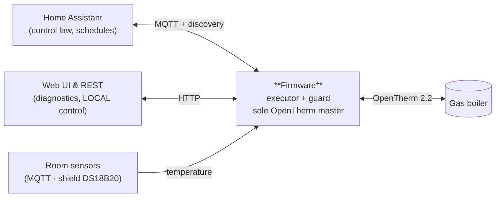

# OpenTherm Thermostat Firmware

**A safe, self-contained executor for a modulating gas boiler — controlled by Home Assistant, but never dependent on it.**


Own room-thermostat firmware for a gas boiler with an **OpenTherm** interface. One board, one
universal binary, everything configured at runtime from a browser. It exposes one model of the
boiler over three surfaces — **MQTT + Home Assistant, an HTTP REST API, and its own web UI** — and
it is designed around a single idea: **the smart part lives in Home Assistant; the safe part lives
on the device.**

---

## The goal

A boiler must never be left in an unsafe or uncontrolled state — not when Wi-Fi drops, not when the
MQTT broker dies, not when Home Assistant is rebooting, not when the firmware itself reboots in a
loop. Cloud thermostats and naive integrations fail exactly here: they treat "lost connection" as
"do nothing", and for an OpenTherm boiler *doing nothing is the hottest, most dangerous state.*

This firmware separates the two concerns cleanly:

- **Home Assistant is the brain** — schedules, scenarios, the owner's sensors, every "when to heat
  and how hot" decision.
- **The firmware is the executor and the guard** — the sole OpenTherm master on the bus, the holder
  of the commanded state, the enforcer of value bounds, the watchdog, and a bounded failsafe that
  takes over the moment the controller goes quiet.

It is **not** an OpenTherm Gateway: it does not sit between an existing thermostat and the boiler.
The device *is* the thermostat.

## Architecture at a glance



Two operating modes, switched at runtime:

- **LOCAL** (default on a fresh flash) — driven from the device's own web UI / REST: a stored CH
  enable, a stored flow setpoint, and an optional boost. Home Assistant's commands are refused.
- **HA** — Home Assistant is the controller. The firmware carries out its commands (within bounds
  and ownership rules), runs the watchdog, and enters the failsafe if HA falls silent.

## Features

### Control & integration
- **Home Assistant MQTT auto-discovery** — every entity appears in HA with **no hand-written YAML**.
- **Full HTTP REST API** — every action the web UI can take, `curl` can take too. No privileged
  endpoints.
- **Own web UI** (Preact + Vite + TypeScript, embedded in the binary) — a live boiler diagnostics
  page, a full state view, an executor control card, controller settings, and a log screen.
- **One source of truth for entities** — REST, MQTT topics, HA discovery and the frontend types are
  all generated from a single Python descriptor. ~68 boiler and executor entities.

### Safety & reliability (the point of the project)
- **The bus never goes silent.** No peripheral failure — Wi-Fi, broker, a stale sensor, a dead
  Home Assistant — may ever stop the OpenTherm conversation.
- **Bounded failsafe.** If the controller goes quiet past a watchdog deadline, the firmware holds a
  safe, bounded heat level rather than trusting a stale command or falling silent.
- **Reboot-loop safe.** `RTC_NOINIT` accumulators survive resets, so the watchdog and the failsafe's
  summer bound still fire correctly even under a fast crash loop.
- **Nothing reboots because a peer is absent.** A missing broker or controller is a normal state,
  not a reason to restart.
- **Values are always bounded.** Every setpoint is clamped to the boiler's advertised range; the
  mode, the season switch and the watchdog are not even reachable over MQTT.

### Boiler observability
- Reads and decodes the boiler's OpenTherm Data-IDs, with three-valued availability
  (`ok` / `invalid` / `unsupported`) discovered at runtime.
- Modulation, temperatures, pressure, flow, fault flags and diagnostic codes surfaced as entities.

### Room sensing
- A registry of room-temperature sources with outlier filtering and freshness tracking; a
  safety-critical **steer** pick (a fresh, room-role source) kept separate from a **display** pick.
- Adapters today: an MQTT source and the shield's DS18B20. Wi-Fi push/pull, BLE and general 1-Wire
  are planned.

### Operations
- **One universal binary**, everything configured at runtime — no per-device builds.
- **Captive-portal provisioning** for first-boot Wi-Fi setup.
- **Write-only secrets** — a stored password is never returned by any API; a read hands back a
  sentinel.
- **Dual-slot OTA** partitions for safe over-the-air updates.
- **No Arduino** anywhere — pure ESP-IDF, core and libraries.

## Hardware

Two supported boards from one binary (selected by `IDF_TARGET`):

| Board | Chip | OT IN | OT OUT | Notes |
| --- | --- | --- | --- | --- |
| **LOLIN C3 mini** (main) | ESP32-C3FH4, 4 MB flash | GPIO8 | GPIO10 | the shield plugs in without soldering |
| **ESP32-C6 SuperMini** | ESP32-C6FH4, 4 MB flash | GPIO18 | GPIO19 | connected to the shield with four wires |

**DIYLESS ESP8266 Thermostat Shield** — a stacking shield in the D1 mini form factor, the OpenTherm
master front-end. It is laid out for the ESP8266, so the GPIO numbers **do not match** the DIYLESS
documentation. Wiring details and the strapping-pin catch are in
[`docs/diyless-opentherm-master-shield.md`](docs/diyless-opentherm-master-shield.md) and
[`docs/esp32-c3-mini.md`](docs/esp32-c3-mini.md).

The firmware runs on a real Intergas Kombi Kompakt HRE boiler, talking to Home Assistant over MQTT.

## Build & flash

```sh
pio run -e lolin_c3_mini            # main board; the SPA build is part of it
pio run -e supermini_c6             # second target, ESP32-C6 SuperMini
pio test -e native                  # host suites -- the barrier for any protocol change
pio run -e lolin_c3_mini -t upload  # flashing

cd web && npm run dev               # SPA dev server
cd web && npm run build             # web build
cd web && npm test                  # web test suites
```

`pio` may be missing from `PATH`; it lives at `~/.platformio/penv/bin/pio`.

The protocol, state, executor core, room-source filter, JSON and command layer are **pure** and
tested on the host — the same sources the device runs, compiled for a workstation with no board
attached. Host tests are written before the implementation.

## Web interface

The SPA is embedded in the firmware (no separate hosting) and served by the device:

- **Boiler** — live diagnostics: modulation, temperatures, pressure, flow, faults, animated.
- **State** — the full entity model with availability and timestamps.
- **Control** — the executor card (CH enable, flow setpoint, boost) in LOCAL mode.
- **Settings** — controller mode, MQTT broker, Wi-Fi, room sources, secrets.
- **Log** — the on-device log ring over `GET /api/log`.

UI strings are English, with DE/NL/UK translations available as a web-only overlay; Home Assistant
discovery names stay English.

## Documentation

| Path | What is in it |
| --- | --- |
| [`docs/firmware-design.md`](docs/firmware-design.md) | the design and reference: executor core, bus, entities, MQTT/HA, room sources, failure model, configuration, and a boiler-reference appendix |
| [`docs/implementation-reference.md`](docs/implementation-reference.md) | the code-level reference: layered architecture, safety invariants and where each is enforced, end-to-end flows, per-component index |
| `components/<name>/README.md` | one per component — the full per-component implementation doc |
| [`CLAUDE.md`](CLAUDE.md) | the engineering rules that carry load |
| [`docs/hardware-verification/`](docs/hardware-verification/) | test scenarios the owner walks on real hardware, grouped by what the device does |

## What the firmware deliberately does *not* do

No PID/PI control loop, no anti-windup, no weekly schedule, no modes engine, no anti-cycling, no
room-temperature control loop. Those belong to the controller (Home Assistant), by design — the
firmware only executes and guards.

## Origin

The infrastructure (Wi-Fi, HTTP, MQTT, configuration, provisioning, SPA) was carried over from
`../heater-firmware` — the Zehnder ComfoAir Q firmware, which stays working and untouched. The
OpenTherm master, executor, entities and boiler integration are specific to this project.

## License

Released under the **Apache License 2.0** — see [`LICENSE`](LICENSE).
Copyright © 2026 Oleksandr Slukovskyi ([@blade-running-man](https://github.com/blade-running-man)).

If you use, modify or redistribute this code, you must **keep the attribution** —
carry the [`NOTICE`](NOTICE) file with your distribution (Apache-2.0 §4(d)) and retain the
copyright notices. That is the reference back to the author the licence requires.
